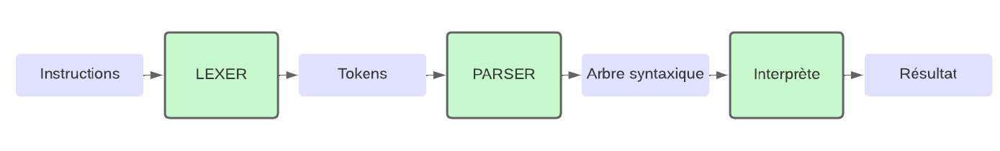
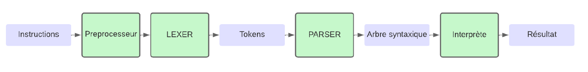
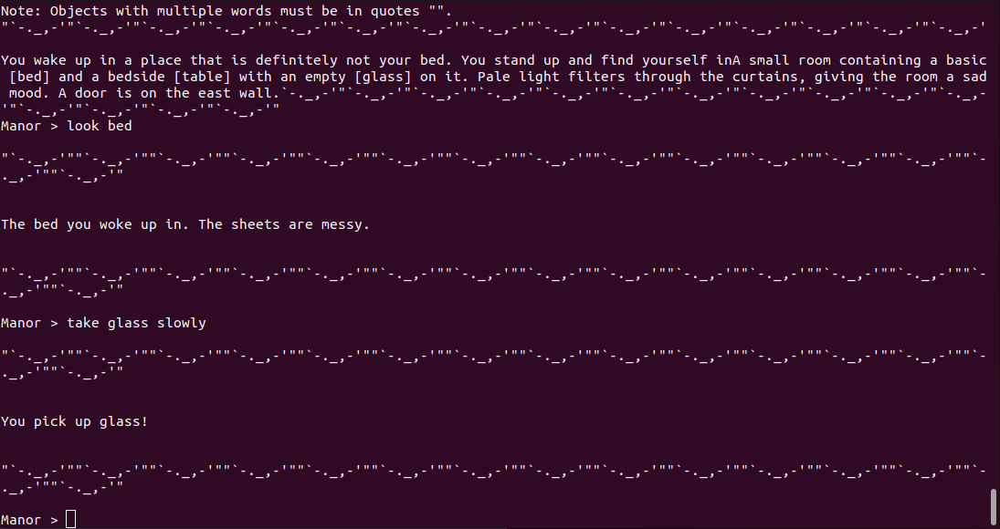
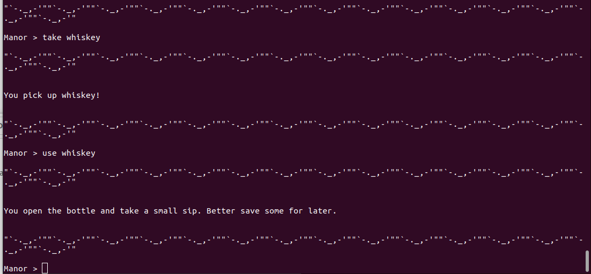
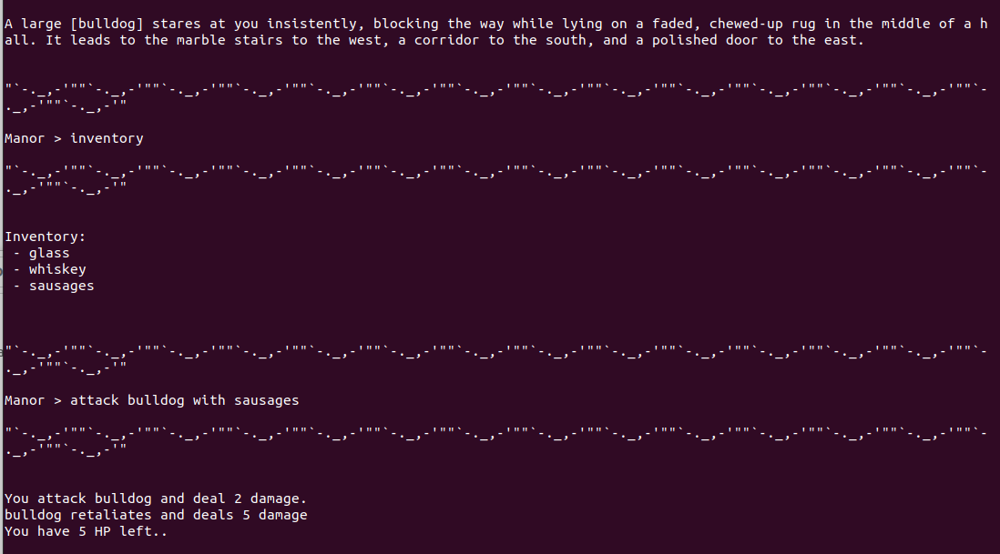

# **Text-Adventure-DSL-Interpreter**
*Custom DSL & NLP Engine: From Smart Home to Interactive Fiction*

*Paris 8 University (Compilation & Interpretation - Bachelor Legacy) - 2022 Original Development*

*2026 Refactored for Translation*

---

## 📌 Overview

This project is a comprehensive language processing pipeline developed as part of the Interpretation & Compilation curriculum at Paris 8 University. It features a custom Domain-Specific Language (DSL) designed to bridge the gap between natural language input and structured game logic in an interactive fiction environment.

  

## 🎯 Project Intentions

The core objective was to move beyond hardcoded conditional logic by implementing a formal compilation pipeline. The engine treats player commands as a language to be parsed, validated, and executed.

  

Key architectural goals included:

* **Abstraction of Game Data**: Using a structured "World Model" (nested dictionaries) separate from the engine.
* **Lazy Evaluation**: Utilizing Python lambdas within the data structure to allow dynamic descriptions that reflect the real-time state of the game world.
* **Linguistic Flexibility**: Handling the inherent ambiguity of human languages (synonyms, conjugations, and multi-language support).

## 🏗 Technical Architecture

The system is built using the **SLY (Sly Lex-Yacc)** library, following four-stage transformation:
1. **Fuzzy Preprocessing** (`preprocessor.py`)

Unlike traditional compilers, this engine starts with a Normalization & Translation Layer.
* **Synonym Mapping**: Converts varied English/French inputs (e.g., "Look at", "Examine", "Voir") into a single canonical token (INSPECT).
* **Stemming/Lemmatization**: Reduces conjugated verbs to their root form.
* **Sanitization**: Handles accent normalization (UTF-8 to ASCII-friendly) and ensures balanced quotes to prevent parser crashes.

  

2. **Lexical Analysis** (`lexer.py`)

The Lexer tokenizes the normalized string into a stream of terminal symbols.
* **Identifies Keywords** (Actions like GO, TAKE, USE).
* **Distinguishes** between WORD (single identifiers) and STRING (quoted literals).
* Implements error handling for illegal characters.

3. **Syntactic Analysis** (`parser.py`)

The Parser implements a Context-Free Grammar (CFG) to define valid sentence structures.
* **Recursive Rules**: Uses an expr rule to handle complex object names (e.g., glass of whiskey vs "glass") without requiring constant quotes.
* **AST Construction**: Transforms the token stream into an actionable tuple-based tree (e.g., ('use_with', 'item1', 'item2')).

4. **Dynamic Interpretation** (`interpreter.py` & `game.py`)

The Interpreter acts as the execution engine.
* **State Management**: Modifies the game_state dictionary in real-time.
* **Dynamic Context**: Executes lambdas from game.py during the "Look" and "Move" actions, ensuring that if an item is picked up, the room description updates immediately.

## 🛠 Features & Innovation
* **Lazy Programming**: Descriptions are not static strings but executable functions. This allows for complex logic within the data (e.g., "If the bulldog is asleep, the rug is visible").
* **Hybrid Parser**: The grammar is designed to be permissive with "natural" phrasing while maintaining the strictness required for a DSL.
* **DSL Editor Commands**: Includes built-in commands to modify the game world on the fly (`SET_ROOM`, `ADD_INV`, `SET_DESCRIPTION`), essentially making it a live game development environment.

## 🚀 Getting Started
### Prerequisites & Dependencies:

    Python 3.8+

    SLY library: pip install sly

### Execution

Launch the game engine:

    python interpreter.py

### Example Commands
* look & take
 

  

   

* take & use
 

  

   

* inventory & attack with
 

  

   

## 🧩 Engine Agnosticism & Modular Design

Beyond the "Mansion" scenario, this engine's core is strictly decoupled from the game data. The pipeline is designed to be **domain-agnostic**:

* **Versatility**: While currently configured for interactive fiction, the Lexer/Parser logic could be redirected to control **Smart Home automation** (e.g., `USE "light" WITH "off"`) or **Industrial Workflows**.
* **Plug-and-Play Data**: By simply swapping the `game.py` dictionary and adjusting the Preprocessor translation matrix, the entire system can interpret a completely different set of instructions and logic without touching the core compiler code.